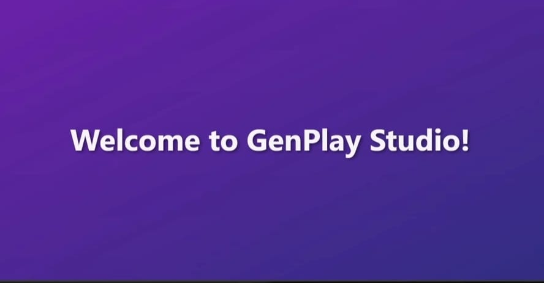
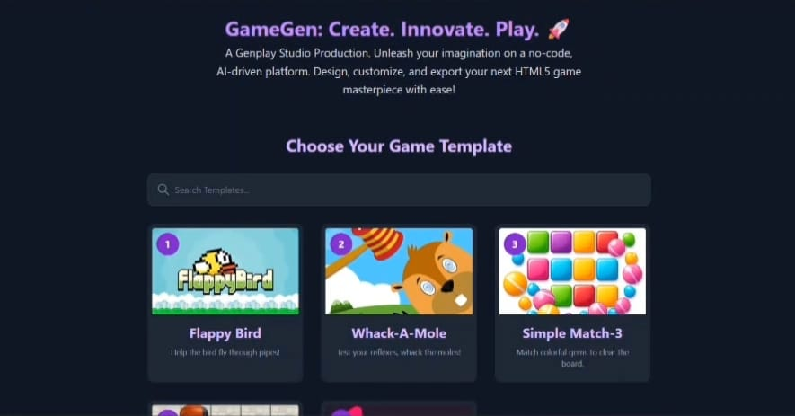
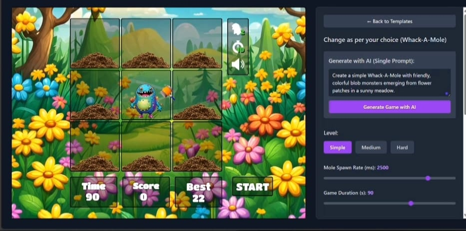
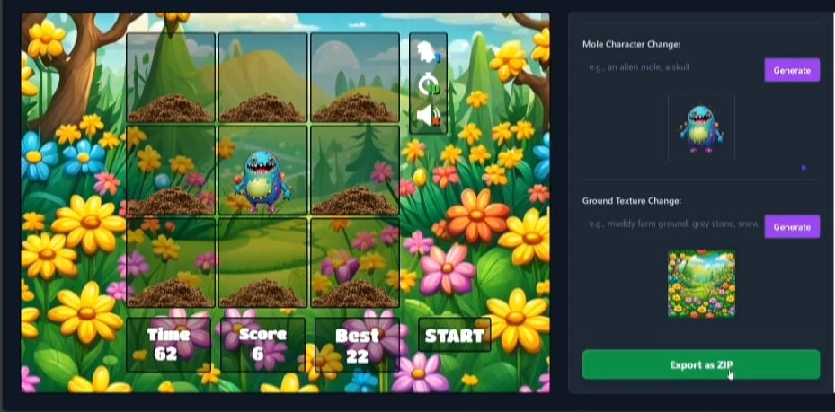

# GenPlay Studio!  
**Empowering Everyone to Create Personalized HTML5 Games with AI**
 ## 🔍Preview
Here’s a glimpse of **GenPlay Studio** in action:
<table style="width:100%;">
  <tr>
    <td align="center">
      
      <br>
      <em>Home Screen</em>
    </td>
    <td align="center">
      
      <br>
      <em>Game Template Selector</em>
    </td>
  </tr>
  <tr>
    <td align="center">
      
      <br>
      <em>AI Customization</em>
    </td>
    <td align="center">
      
      <br>
      <em>Exported Game Ready for Export</em>
    </td>
  </tr>
</table>


---

## 📚 Table of Contents
- [About the Project](#about-the-project)  
- [Features](#features)  
- [Key Strengths & Criteria Alignment](#key-strengths--criteria-alignment)  
- [Getting Started](#getting-started)  
  - [Prerequisites](#prerequisites)  
  - [Installation](#installation)  
  - [Usage](#usage)  
- [Future Enhancements](#future-enhancements)  
- [What's Open for Exploration](#whats-open-for-exploration)  
- [Contributing](#contributing)  
- [Submission Terms](#submission-terms)  
- [Contact](#contact)  

---

## 🧩 About the Project

**GenPlay Studio!** is a cutting-edge, web-based tool designed to make game creation accessible to everyone, regardless of their coding background.  

Leveraging advanced artificial intelligence, our platform allows users to select from a variety of classic game templates, then personalize them with unique AI-generated visuals and fine-tune gameplay parameters through a single, high-level prompt.  

All creations culminate in a fully playable, exportable HTML5 (H5) game.  
> Our mission is to transform complex game development into a simple, intuitive, and fun experience for non-technical users.

### 🔧 Built With
- **Frontend:** React.js, HTML5 Canvas, Tailwind CSS  
- **Backend / AI Integration:** Node.js (Express.js, path, fs, fs/promises, cors, archiver)  
- **AI Models via [SegMind](https://www.segmind.com):**  
  - SegMind Vega – text-to-image generation  
  - bg-removal-v2 – background removal  
  - Claude 3 Haiku – gameplay & visual logic adaptation  
- **Deployment:** Locally Hosted

---

## 🚀 Features

### 🎮 Intuitive User Workflow
 #### Welcoming screen → Game template selector → Single prompt customization → Export as playable game.

### 🕹️ Five Classic Game Templates
- Flappy Bird  
- Speed Runner  
- Whack-the-Mole  
- Simple Match-3  
- Crossy Road  

### 🎨 AI-Powered Customization: Visuals and Gameplay

**Dynamic Generative Art Assets**
- Generate characters, backgrounds, obstacles using AI prompts  
- Real-time image generation via SegMind Vega  
- Transparent sprites via bg-removal-v2  

**Intelligent Parameter Control & Thematic Transformation**
- Use natural prompts like:  
  - “make it hard and horror themed”  
  - “create a sci-fi adventure”  
- Claude 3 Haiku interprets and applies:  
  - Theme-consistent visuals  
  - Gameplay dynamics: speed, gravity, object gaps, power-ups

**Direct Parameter Control**
- Sliders and inputs for manual tuning

### ⚡ Fast & Interactive Reskinning
- AI-driven customization under 1 minute

### 📦 One-Click H5 Export
- Download game as zipped `index.html` package for offline play

---

## 🏆 Key Strengths & Criteria Alignment

| Criteria             | Description |
|----------------------|-------------|
| **Technical Execution** | Robust AI integration for both visuals and gameplay |
| **Usability**        | Easy, step-by-step interface for non-technical users |
| **Export Quality**   | Fully functional HTML5 game downloads |
| **AI/LLM Usage**     | Unique generative AI for visual + logic tuning |
| **Speed**            | ~1 min for game transformation |
| **Bonus Features**   | Added exploration of advanced enhancements |

---

## 🛠️ Getting Started

### ✅ Prerequisites
- Node.js  
- npm or yarn  
- Git  
- [SegMind API Key](https://www.segmind.com)

---

## 📥 Installation

```bash
# Clone the repo
git clone https://github.com/darshna21-bit/gamegen-project.git

# Navigate to project
cd gamegen-project

# Install frontend dependencies
npm install

# (If backend is separate, cd backend && npm install, then cd ..)
# Or:
npm install # if everything is in a single package.json

# Add SegMind API Key
# In backend directory, create a .env file:
echo "SEGMIND_API_KEY=your_segmind_api_key_here" > backend/.env
```

---

## ▶️ Usage

```bash
# Start frontend
npm start

# Start backend
node server.js
```

Then go to [http://localhost:3000](http://localhost:3000)  
Follow the workflow:

1. Pick a template  
2. Enter AI prompt  
3. Export your H5 game

---

## 🧠 Future Enhancements

- AI-generated background music  
- Prompt-based logic changes  
- Mobile-friendly controls  
- More game templates  
- TikTok-style shareable game feed

---

## 🔍 What's Open for Exploration

- Expand template library  
- New personalization ideas  
- Export to new formats / direct publish  
- Innovative game design workflows

---

## 🤝 Contributing

```bash
# Fork repo
# Create feature branch
git checkout -b feature/AmazingFeature

# Commit changes
git commit -m "Add some AmazingFeature"

# Push changes
git push origin feature/AmazingFeature

# Open pull request
```

---

## 📜 Submission Terms

Submitted to the **KGen.io Hackathon**.  
> Per rules, selected top submissions — including code, assets, exported games — become organizer property.

---

## 📬 Contact

**Team:** PromptPlay  
**Solo Developer:** Darshna Shingavi  

- 📧 [darshnashingavi21@gmail.com](mailto:darshnashingavi21@gmail.com)  
- 🔗 [GitHub Repo](https://github.com/darshna21-bit/gamegen-project)

---
